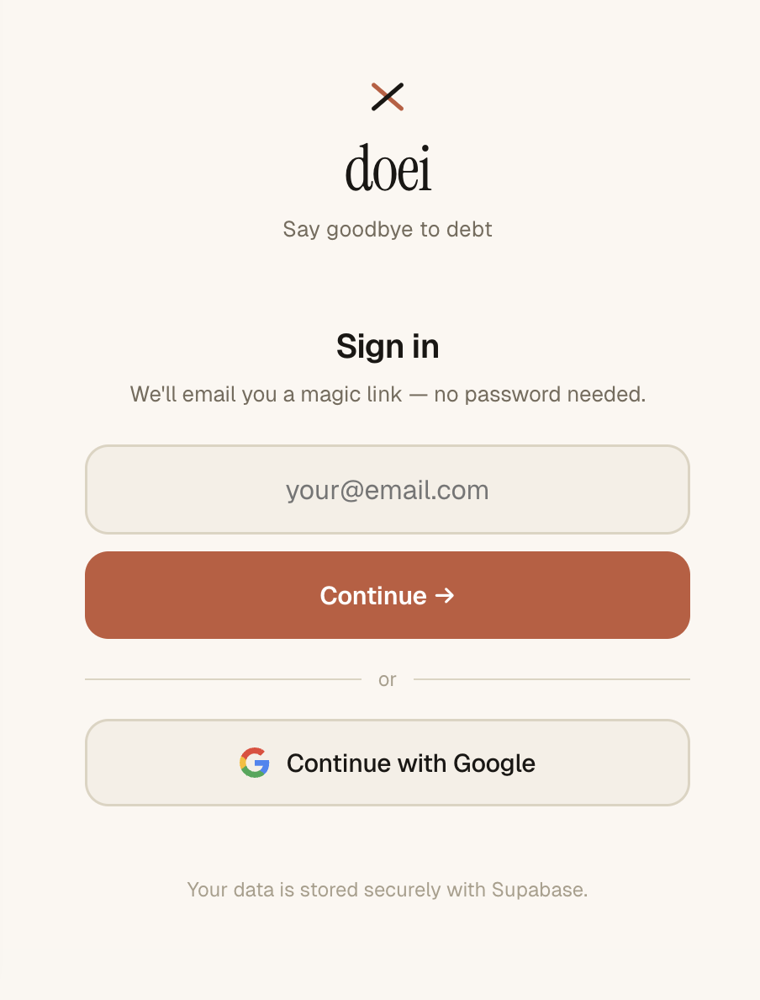
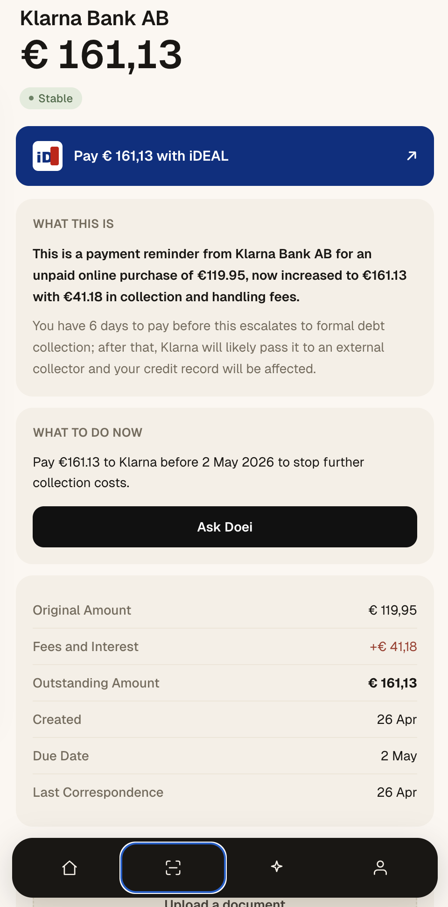
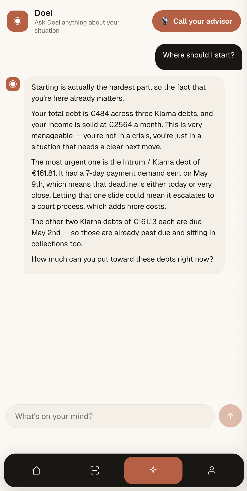
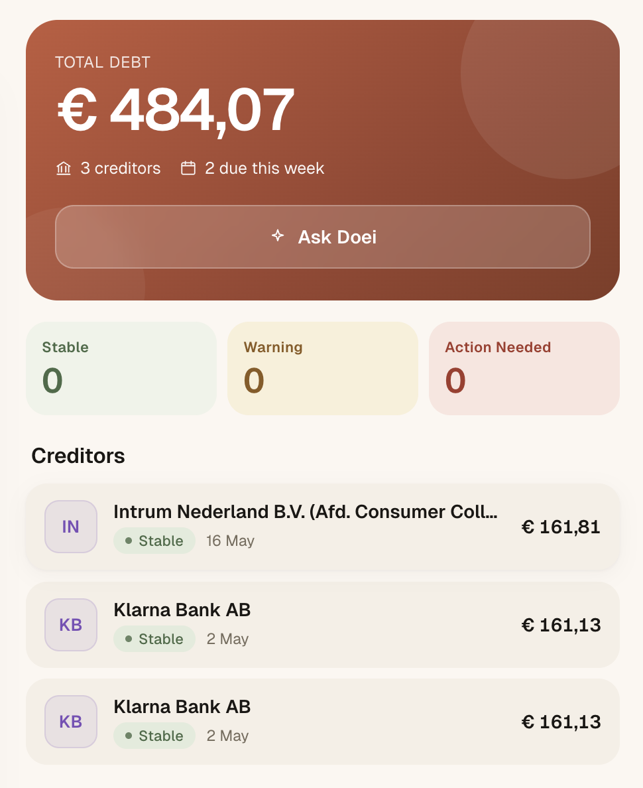
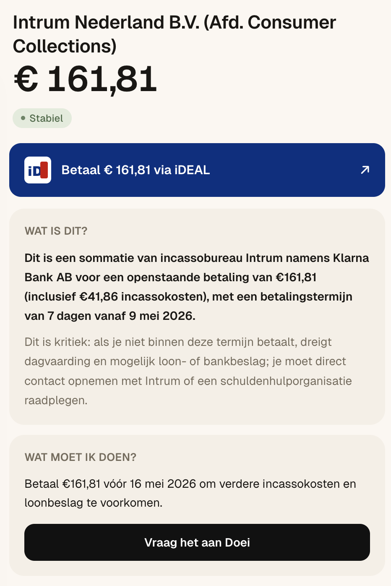
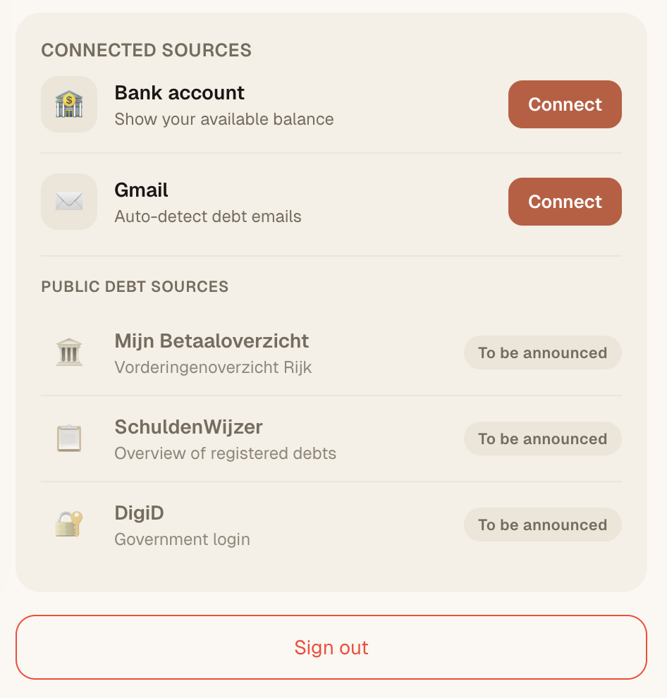

# doei

> **Dutch for "bye" — as in, bye debt.**
> One integrated overview of household debt — for the household and their advisor.

**🎯 Try it live (mobile-first): [doei-alpha.vercel.app/app](https://doei-alpha.vercel.app/app)**

---

## 🚧 Heads up — this is not (yet) the open-source product

This repository is the **hackathon prototype** that the production `doei` is being built from. I'm actively building the real product — it is **not currently open source**, and this repo is a starting point / reference, not the live codebase. Things will move fast, break, and diverge.

👉 **Want to be notified when it ships?** [Join the waitlist](https://example.com/waitlist) (placeholder — real link coming soon).

---

## The problem

In the Netherlands, **700k+ households (8.8%)** have problematic debt — costing society **€8.5B a year** in lost productivity and support. The average household juggles **13 creditors**, each sending letters, emails, and calls through their own channel. People receive tens to hundreds of collection notices a year, scattered across mailboxes, drawers, and call logs — never assembled into one picture.

There is no single overview. Households and their advisors are flying blind.

That's what `doei` fixes.

## What it does

**Two ways in — one overview:**
- 🏛️ **Public & registered debts** — pulled automatically from official registries (Mijn Betaaloverzicht, Schuldenwijzer) the moment the household connects
- 📥 **Snap a photo of any paper bill** — Claude parses creditor, amount, due date, and urgency. Anything outside the registries, covered in seconds.

**What Doei does with that data:**
- 🚨 **Triage** — every debt auto-classified by escalation signals: sommatie / overdue / fees added / public-creditor garnishment power / huur eviction risk / CAK threshold. Critical debts surface to the top.
- 🧠 **"Wat is dit?" / "Wat moet ik doen?"** — 2-sentence plain-language explanation + prominent CTA ("Bel Intrum vandaag op 088-7868911") + 2 supporting actions, quoting deadlines from the actual letter
- 💬 **Chat with Doei** — full debt + income context. Multi-debt pay plans rendered as ranked iDEAL action cards. Speaks NL or EN.
- 📞 **Call Doei** — voice agent (LiveKit + Deepgram + Cartesia), responds to "Hey Doei", remembers past calls, books follow-ups on Google Calendar
- 👥 **Built for advisors too** — the same live overview works for schuldhulpverleners managing a household's full picture at a glance

## Wow moments worth demoing

| Moment | Why it lands | Screenshot |
|---|---|---|
| Login | Trust-building entry; no debt shame, just a calm next step |  |
| Drop a debt letter | Parses creditor, amount, deadline, and urgency from a photo — no form-filling |  |
| Ask Doei about your debts | Full debt context + empathy; suggests exact actions with iDEAL payment links |  |
| Full debt overview | Prioritized by urgency — tells you the one thing to do today |  |
| Switch language NL ↔ EN | AI responses switch too — meets users in their own language |  |
| Connect data sources | Pulls from Mijn Betaaloverzicht + Schuldenwijzer for verified public-creditor debts |  |

## How it works

```
Letter (PDF/photo)
  └── Supabase Storage (per-user folder)
       └── /api/document/analyze (Claude Sonnet 4.6 vision)
            └── { creditor, amount, dueDate, stage, notes, extracted_text }
                 ├── debts row inserted (Supabase, RLS-scoped to auth.uid)
                 └── documents row linked to debt + extracted_text saved

Debt detail screen
  └── reads debt + attached docs.extracted_text
       └── /api/advisor (Claude Haiku 4.5)
            ├── "What this is" (2 sentences, urgency-calibrated)
            └── "What to do" (CTA + 2 supporting actions, quoting letter deadlines)

Voice call
  └── /api/voice/token (issues LiveKit token)
       └── voice-agent/ Python worker (Deepgram STT + Claude + Cartesia TTS)
            ├── named "Doei", responds to wake-name
            ├── reads past_calls table for continuity
            └── can call schedule_followup_call → Google Calendar
```

## Stack

- **Frontend:** React 18 + Vite, bespoke design tokens — no component library, no Tailwind
- **Backend:** Vercel serverless (Node) for HTTP routes, Python LiveKit worker for voice
- **Data:** Supabase Postgres with RLS on every table; Supabase Storage for letters
- **AI:** Claude Sonnet 4.6 (vision OCR + chat + voice), Haiku 4.5 (fast per-debt advice cards)
- **Voice:** LiveKit (transport) + Deepgram (STT) + Cartesia (TTS)
- **Observability:** LangWatch traces on every AI call
- **Integrations:** Google OAuth (Gmail readonly + Calendar.events) for letter ingest + follow-up booking

## What we built during the hackathon

- Migrated debts from `localStorage` → Supabase with RLS, refactored every read/write
- Added `documents.extracted_text` so the AI quotes the letter body, not just metadata
- Generated 13 realistic Dutch vendor PDFs (8 distinct templates: government / utility / sommatie / BNPL / housing / bank / insurance / CJIB-yellow) for live demos
- Wired up the LiveKit voice worker, named the AI **Doei**, taught both chat and voice to recognize "Hey Doei"
- Per-debt urgency-signal engine: reads notes + letter body to flag sommatie / overdue / public-creditor garnishment / eviction / CAK 6-month threshold
- Restructured debt detail around two cards: "Wat is dit?" (urgency + plain language) and "Wat moet ik doen?" (CTA + actions)
- Auto-navigate from add-debt → debt detail with the just-uploaded letter attached
- Pay-plan refactor: each item is an honest action (iDEAL deeplink when available, plain "betaal via je bank" otherwise)

## Roadmap

- [ ] **"What if I do nothing" projection** — 90-day fee compounding timeline
- [ ] **Debt-free simulator** — monthly capacity slider, live snowball/avalanche chart
- [ ] **Real PSD2 bank connect** via Tink or Salt Edge (currently mocked)
- [ ] **DigiD + SchuldenWijzer + Vorderingenoverzicht Rijk** for verified public-creditor debts
- [ ] **In-browser wake-word** ("Hey Doei") via Porcupine
- [ ] **Auto-draft hardship letter** for public creditors → downloadable PDF
- [ ] **Verified Google app status** (Gmail scopes currently limited to test users)

## Codebase notes

- Design tokens in CSS vars (`--paper-0/1/2/3`, `--ink-0/1/2/3`, `--accent`, `--stable/warning/action-fg/bg/tint`) — all bespoke
- Page transitions via the `screen-in` class (CSS keyframes in `globalCSS`)
- Creditor logic centralized in `src/schuld/constants/creditors.js` — adding a new creditor type is one row
- Chat advisor system prompt is the canonical AI behavior config; voice prompt mirrors it in `voice-agent/prompts.py`

## Credits

Built for **Whale × Anthropic** — Aryan Sharma, with substantial pair-coding by Claude Sonnet 4.6 via Claude Code.

Inspired by everyone in NL who has ever opened a blue envelope and felt their stomach drop.

---

## Run it

### 1. Prerequisites

- Node.js 18+ and npm
- Python 3.10+ (only if you want the voice agent)
- A free [Supabase](https://supabase.com) project
- A [LiveKit](https://livekit.io) project (only for voice)
- API keys for the AI providers you want to use (Anthropic, Deepgram, Cartesia)

### 2. Configure environment variables

```bash
cp .env.example .env
# then fill in the values — see comments in .env.example for what each is for
```

Only the Supabase block is strictly required. Gmail, LiveKit, LangWatch, and
the voice-agent providers are each independently optional and gracefully no-op
when their env vars are missing.

### 3. Provision the database

Apply the SQL files in `supabase/` to your Supabase project (paste each into
the SQL editor and run, or use the Supabase CLI). They create the `calls`,
`scheduled_calls`, and `gmail_connections` tables with RLS policies. The
`debts`, `documents`, `suggested_debts`, and `bank_connections` tables you'll
need to create from the schema referenced below — RLS by `user_id` is
mandatory.

### 4. Run the app

```bash
npm install
npm run dev          # frontend on :5173
npx vercel dev       # frontend + API routes locally
```

For voice:

```bash
cd voice-agent
python -m venv .venv && source .venv/bin/activate
pip install -r requirements.txt
python agent.py dev
```

To regenerate the 13 mock Dutch debt letters:

```bash
python3 scripts/generate_mock_debt_letters.py
```

## Env vars

See [`.env.example`](.env.example) for the full, documented list. Quick summary:

| Group | Vars | Required? |
|---|---|---|
| Supabase (browser) | `VITE_SUPABASE_URL`, `VITE_SUPABASE_ANON_KEY` | ✅ |
| Supabase (server) | `SUPABASE_URL`, `SUPABASE_SERVICE_ROLE_KEY` | ✅ |
| Supabase MCP | `SUPABASE_MCP_TOKEN`, `SUPABASE_PROJECT_REF` | optional |
| AI | `ANTHROPIC_API_KEY` | for voice agent |
| Voice transport | `LIVEKIT_URL`, `LIVEKIT_API_KEY`, `LIVEKIT_API_SECRET` | for voice |
| Voice STT/TTS | `DEEPGRAM_API_KEY`, `CARTESIA_API_KEY` | for voice |
| Gmail | `GMAIL_CLIENT_ID`, `GMAIL_CLIENT_SECRET` | optional |
| Cron | `CRON_SECRET` | for scheduled Gmail sync |
| Observability | `VITE_LANGWATCH_API_KEY` | optional |
| Misc | `APP_URL`, `PORT` | defaults are fine |

## API routes

| Route | What it does |
|---|---|
| `POST /api/advisor` | Chat with Doei (system prompt has full debt + income context) |
| `POST /api/document/analyze` | Vision OCR → structured debt fields + extracted text |
| `POST /api/voice/token` | Mint LiveKit access token for an authenticated user |
| `POST /api/voice/end-call` | Persist transcript + AI-generated summary |
| `POST /api/gmail/connect` | Save user's Google refresh token after OAuth |
| `GET /api/gmail/status` | Is Gmail connected, with which email |
| `POST /api/gmail/sync` | Run Gmail MCP search → flag debt emails as suggested debts |
| `POST /api/gmail/disconnect` | Remove Google connection |
| `GET /api/cron/gmail-sync` | Daily 06:00 UTC sweep across all connected users |

## Supabase schema

| Table | Purpose |
|---|---|
| `debts` | Source of truth for user debts (RLS by `user_id`) |
| `documents` | Letter attachments per debt + extracted text (RLS by `user_id`) |
| `suggested_debts` | Pending suggestions from Gmail/bank ingest awaiting user accept |
| `bank_connections` | Mock PSD2 connection records |
| `gmail_connections` | Per-user Google refresh tokens |
| `calls` | Voice-call transcripts + AI summaries (powers continuity across calls) |
| `scheduled_calls` | Booked follow-up calls + Google Calendar event IDs |

RLS is on by default everywhere. Service role is only used in API routes; the browser client uses the anon key.

## License

[MIT](LICENSE). Contributions welcome — open an issue or PR.
